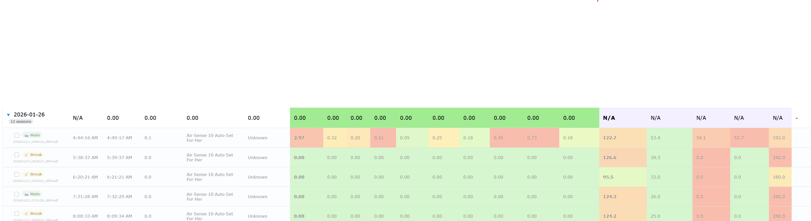

ToDo:

REFERENCE: Use OSCAR source code (https://gitlab.com/CrimsonNape/OSCAR-code as reference for CPAP data parsing/normalization. They handle ResMed, Philips, and many other machines. If their parsing looks wrong, file a bug or fix and upstream. User has contributed upstream fixes before. Local copy at K:\cc\sleepanalysis\OSCAR-code.   Parsers are K:\cc\sleepanalysis\OSCAR-code\oscar\SleepLib\loader_plugins

AGENTS: Document everything thoroughly as you go. Every function, every data format, every parsing decision. Write docs for yourself and future agents. This codebase is worked on by multiple AI agents across conversations.

3)

Custom session filtering options.  
Remove the show individual sessions button its redundant. 
add the combine sessions.
combine with my hr scoring - https://github.com/AJolly/O2RingCloudDownloader 
Night heatmap needs to show times
Night heatmap flow graph shows times dont line up with flow graph times? iits weirdly off check why
add a time offset correction per cpap machine.
NOTE: Test data is from aircracked ResMed 10 with modded firmware — hacked FW likely causes incorrect PAP mode parsing in STR.edf. Account for this when debugging mode detection. - Main airbreak repo - https://github.com/Asmageddon/airbreak-plus/

backup settings option.

night heaTMAP NEEDS TO USE FULL WIDTH.  
blacklist option

blacklist that then gives me the commands to delete unwanted sessions permanently

debug out of memory issues

hide less than 20m sessions doesnt seem to work?

per day select button as well. 
unchecking or checking sesions doesnt seem to make the score work correctly:  
uncheck all shows as 0 but why is 0 being included in the overall score?

auto open flow map on load so users see that.  

MAKE NOPTE THAT WE ARE USING RELATIVE SCORING, PERHAPS HAVE AN ABSOLUTE SCORING OPTION?  
is our flow graph artificially smoothing the data?